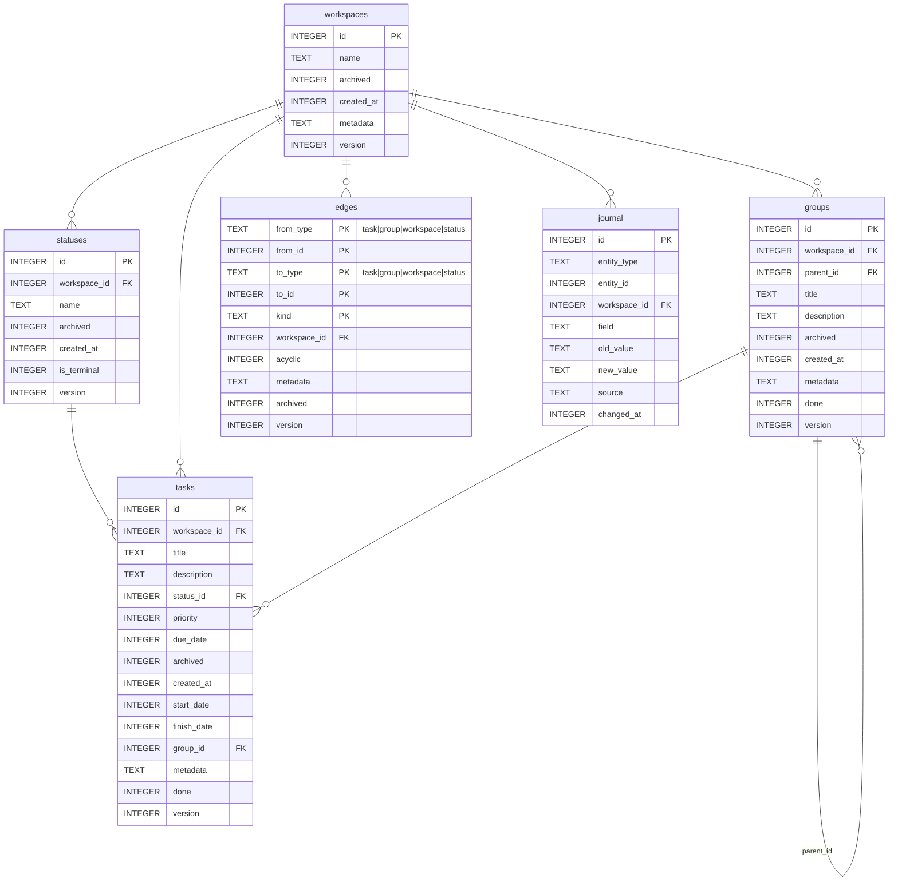

# Entity-Relationship Diagram

> **v2 (legacy).** ERD of the Python app's workspace→group→task schema. The v3 Kotlin daemon uses a different model — see [v3-architecture.md](v3-architecture.md) for the v3 ERD.

