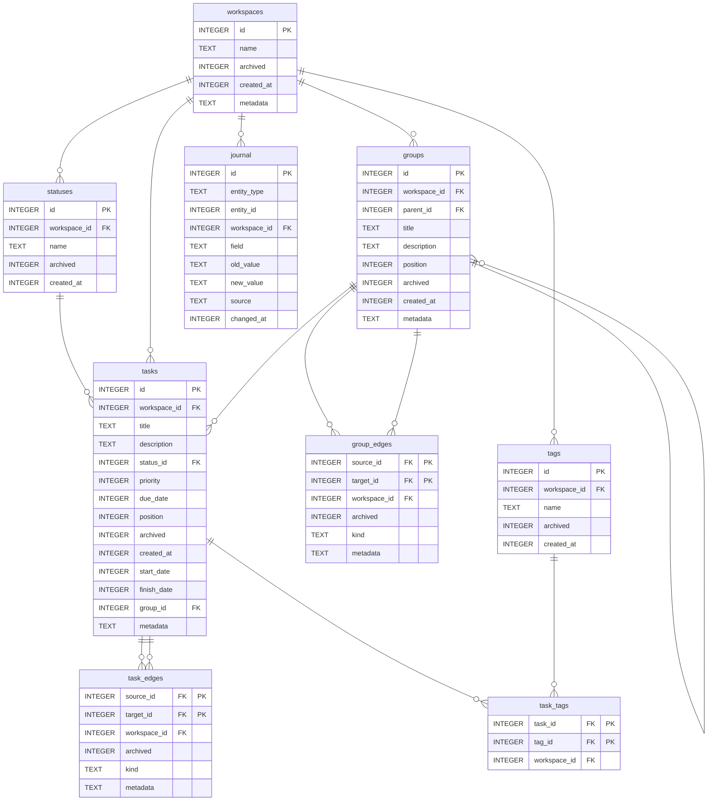

```mermaid
erDiagram
    workspaces ||--o{ statuses : ""
    workspaces ||--o{ groups : ""
    groups ||--o{ groups : ""
    statuses ||--o{ tasks : ""
    workspaces ||--o{ tasks : ""
    groups ||--o{ tasks : ""
    tasks ||--o{ task_edges : ""
    tasks ||--o{ task_edges : ""
    groups ||--o{ group_edges : ""
    groups ||--o{ group_edges : ""
    workspaces ||--o{ tags : ""
    tasks ||--o{ task_tags : ""
    tags ||--o{ task_tags : ""
    workspaces ||--o{ journal : ""

    workspaces {
        INTEGER id PK
        TEXT name
        INTEGER archived
        INTEGER created_at
        TEXT metadata
    }

    statuses {
        INTEGER id PK
        INTEGER workspace_id FK
        TEXT name
        INTEGER archived
        INTEGER created_at
    }

    groups {
        INTEGER id PK
        INTEGER workspace_id FK
        INTEGER parent_id FK
        TEXT title
        TEXT description
        INTEGER position
        INTEGER archived
        INTEGER created_at
        TEXT metadata
    }

    tasks {
        INTEGER id PK
        INTEGER workspace_id FK
        TEXT title
        TEXT description
        INTEGER status_id FK
        INTEGER priority
        INTEGER due_date
        INTEGER position
        INTEGER archived
        INTEGER created_at
        INTEGER start_date
        INTEGER finish_date
        INTEGER group_id FK
        TEXT metadata
    }

    task_edges {
        INTEGER source_id FK "PK"
        INTEGER target_id FK "PK"
        INTEGER workspace_id FK
        INTEGER archived
        TEXT kind
        TEXT metadata
    }

    group_edges {
        INTEGER source_id FK "PK"
        INTEGER target_id FK "PK"
        INTEGER workspace_id FK
        INTEGER archived
        TEXT kind
        TEXT metadata
    }

    tags {
        INTEGER id PK
        INTEGER workspace_id FK
        TEXT name
        INTEGER archived
        INTEGER created_at
    }

    task_tags {
        INTEGER task_id FK "PK"
        INTEGER tag_id FK "PK"
        INTEGER workspace_id FK
    }

    journal {
        INTEGER id PK
        TEXT entity_type
        INTEGER entity_id
        INTEGER workspace_id FK
        TEXT field
        TEXT old_value
        TEXT new_value
        TEXT source
        INTEGER changed_at
    }

```
