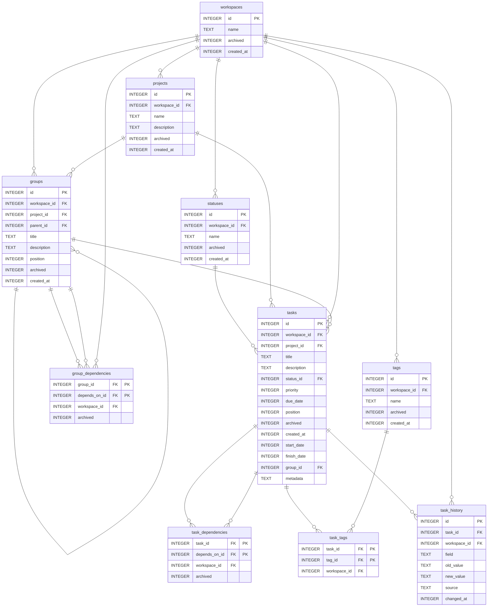

```mermaid
erDiagram
    workspaces ||--o{ projects : ""
    workspaces ||--o{ statuses : ""
    groups ||--o{ groups : ""
    workspaces ||--o{ groups : ""
    projects ||--o{ groups : ""
    statuses ||--o{ tasks : ""
    projects ||--o{ tasks : ""
    workspaces ||--o{ tasks : ""
    groups ||--o{ tasks : ""
    tasks ||--o{ task_dependencies : ""
    tasks ||--o{ task_dependencies : ""
    groups ||--o{ group_dependencies : ""
    groups ||--o{ group_dependencies : ""
    workspaces ||--o{ group_dependencies : ""
    workspaces ||--o{ tags : ""
    tasks ||--o{ task_tags : ""
    tags ||--o{ task_tags : ""
    tasks ||--o{ task_history : ""
    workspaces ||--o{ task_history : ""

    workspaces {
        INTEGER id PK
        TEXT name
        INTEGER archived
        INTEGER created_at
    }

    projects {
        INTEGER id PK
        INTEGER workspace_id FK
        TEXT name
        TEXT description
        INTEGER archived
        INTEGER created_at
    }

    statuses {
        INTEGER id PK
        INTEGER workspace_id FK
        TEXT name
        INTEGER archived
        INTEGER created_at
    }

    groups {
        INTEGER id PK
        INTEGER workspace_id FK
        INTEGER project_id FK
        INTEGER parent_id FK
        TEXT title
        TEXT description
        INTEGER position
        INTEGER archived
        INTEGER created_at
    }

    tasks {
        INTEGER id PK
        INTEGER workspace_id FK
        INTEGER project_id FK
        TEXT title
        TEXT description
        INTEGER status_id FK
        INTEGER priority
        INTEGER due_date
        INTEGER position
        INTEGER archived
        INTEGER created_at
        INTEGER start_date
        INTEGER finish_date
        INTEGER group_id FK
        TEXT metadata
    }

    task_dependencies {
        INTEGER task_id FK "PK"
        INTEGER depends_on_id FK "PK"
        INTEGER workspace_id FK
        INTEGER archived
    }

    group_dependencies {
        INTEGER group_id FK "PK"
        INTEGER depends_on_id FK "PK"
        INTEGER workspace_id FK
        INTEGER archived
    }

    tags {
        INTEGER id PK
        INTEGER workspace_id FK
        TEXT name
        INTEGER archived
        INTEGER created_at
    }

    task_tags {
        INTEGER task_id FK "PK"
        INTEGER tag_id FK "PK"
        INTEGER workspace_id FK
    }

    task_history {
        INTEGER id PK
        INTEGER task_id FK
        INTEGER workspace_id FK
        TEXT field
        TEXT old_value
        TEXT new_value
        TEXT source
        INTEGER changed_at
    }

```
