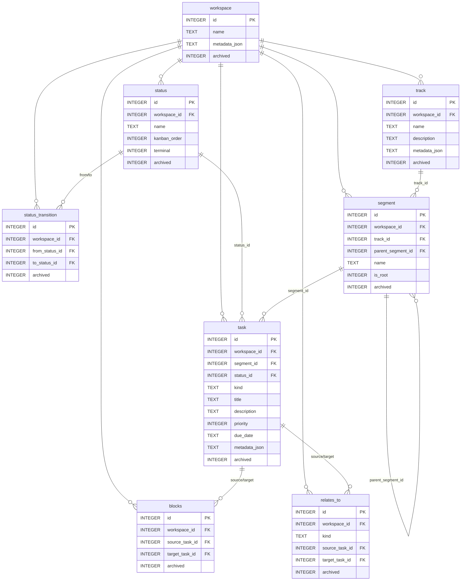

# stx v3 — Architecture (Kotlin daemon)

One-page overview of the v3 Kotlin daemon under `daemon/`. Authoritative design lives in
[`../daemon/docs/stx-v3-design.md`](../daemon/docs/stx-v3-design.md),
[`../daemon/docs/stx-v3-next.md`](../daemon/docs/stx-v3-next.md), and
[`../daemon/docs/stx-v3-implementation-brief.md`](../daemon/docs/stx-v3-implementation-brief.md);
the schema is [`../daemon/src/main/resources/schema.sql`](../daemon/src/main/resources/schema.sql).

> The v2 Python app (`src/stx`, workspace→group→task) still ships and is documented in
> [db-enforced-semantics.md](db-enforced-semantics.md), [service-enforced-semantics.md](service-enforced-semantics.md),
> and [erd.md](erd.md). It is **not yet wired to the daemon**.

## Purpose

stx is a **datastore + frontier server for agent sessions**, run locally. The developer curates the
structure and descriptions; the dev and local agents read it as a tool. A long-lived **daemon is the
sole writer**; clients talk to it over loopback HTTP rather than opening SQLite directly.

## Model

```
workspace → track → segment* → task
```

- **workspace** — top-level environment and the edge boundary (edges never cross it).
- **track** — root-only anchor (never nests, no parent); one coherent line of work; carries
  description + metadata.
- **segment** — nestable PURE FILING node under a track: no metadata, no context, no inheritance.
  `parent_segment_id` forms a tree; denormalized immutable `track_id`. Each track auto-gets exactly
  one root segment (`is_root=1`); "add a task to the track" routes there.
- **task** — the only first-class node: `status_id`, optional single-valued `kind`, description,
  metadata, priority, dates.

**Edges (task↔task only):** `blocks` — the spine, directed, acyclic, drives `next`; `relates_to` —
decorative association, cyclic OK, never affects the frontier.

**Lifecycle:** `status` rows are the kanban stages (`terminal=1` *is* "done" — no separate flag);
`status_transition` is the per-workspace state machine (a move is legal iff a row exists; cycles
allowed; no guards). No `journal` table — history is a non-authoritative append-only sidecar log.

## ERD (v3)



## Daemon-enforced invariants

SQLite enforces FKs, cheap CHECKs, and partial-unique indexes (one live root segment per track; one
live edge per (source,target[,kind]); unique live status names; etc.). The daemon enforces the five
graph invariants SQLite cannot, transactionally (`service/Invariants.kt`, `service/Service.kt`):

1. `blocks` forms a **DAG** — reject an edge that would close a cycle.
2. `segment.parent_segment_id` is **acyclic within a track** — reject a reparent that creates a cycle.
3. **Exactly one root segment per track**, auto-created with the track.
4. **Archive cascade** — archiving a task archives its incident `blocks`/`relates_to` in the same tx,
   so a live edge always joins two live tasks (lets `next` skip checking blocker archived-state).
5. `segment.track_id` is **immutable** — a reparent may not cross tracks.

## `next` (the frontier)

A **filter, not a recommender**. A task is in the frontier iff `archived=0`, status not terminal, and
no live `blocks` edge points at it from a non-terminal task. In-progress tasks stay in. Output is
ordered `priority DESC, id ASC` (presentation only). Scopes: workspace (required); `--track` (flat
filter via the denormalized `segment.track_id`); `--segment` subtree (recursive `parent_segment_id`
walk); `--kind` (orthogonal). Cross-track blockers still gate correctly. **Recompute-on-read — no
caching** — so rework (reopening a terminal task) re-derives the frontier with no stale-cache risk.

## Concurrency & transport

- **WAL**, foreign keys on. All **mutations** flow through ONE write-actor coroutine draining a
  `Channel<Command>`, each in its own transaction, in submission order. **Reads** run concurrently
  against WAL, bypassing the actor.
- **http4k bound to 127.0.0.1 only** — loopback binding is the entire security model (no auth). Every
  response is JSON, including a structured error envelope (`{error, kind}`; Validation→400,
  NotFound→404, Conflict→409).
- **Sidecar log** — on each successful mutation the actor appends one seq-numbered event to
  `$XDG_STATE_HOME/stx/events.log` (after commit, best-effort). Non-authoritative: never read back to
  determine state. SQLite is the source of truth.

## Stack & commands

Kotlin 2.3 / JDK 21, Gradle (Kotlin DSL), http4k, kotlinx.serialization, plain JDBC +
`xerial/sqlite-jdbc`, kotlinx.coroutines. No Spring / gRPC / DI / ORM / auth.

```sh
cd daemon
./gradlew test            # 28 tests
./gradlew installDist && ./build/install/stx-daemon/bin/stx-daemon --port=8473 --db=/path/to/stx.db
```

HTTP surface is tabulated in the repo [README](../README.md#daemon-v3--build--run).
